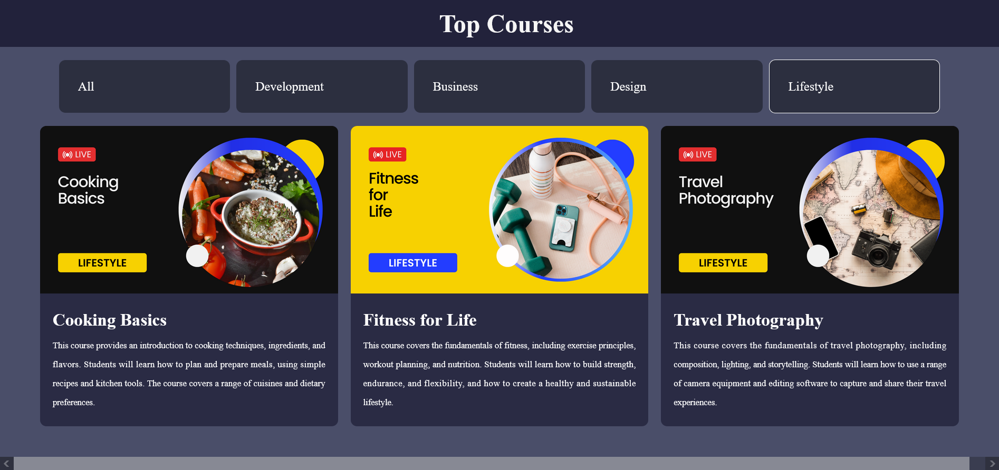

# Edu.io Website

Welcome to Edu.io Website! This project is a web application built with ReactJS to showcase and recommend top courses in various domains.
Features:

   * Browse and search for top courses in different categories.
   * View detailed course information, including title & description.
   * Sort courses based on different categories Development, Business, Design & Lifestyle.
   * Like courses as favorites or dislike.
   * Interactive user interface for an enhanced browsing experience.

Demo Picture

"Click on any part of the image to preview the TOPCourseWebsite."

Demo Video
Installation

To run the project locally, follow these steps:

    Clone the repository: git clone https://github.com/ramgpal/TopCourseWebsite.git
    
    Navigate to the project directory: cd top-course-website
    
    Install the dependencies: npm install
    
    Install the react-icons: npm install react-icons
    
    Intall the react-toastify: npm i react-toastify
    
    Start the development server: npm start
    
    Open your browser and visit http://localhost:3000 to access the website.

Contributing

Contributions are welcome! If you'd like to contribute to this project, please follow these steps:

    Fork the repository.
    
    Create a new branch: git checkout -b feature/your-feature
    
    Make your changes and commit them: git commit -m 'Add some feature'
    
    Push to the branch: git push origin feature/your-feature
    
    Submit a pull request detailing your changes.

Please ensure that your code follows the project's coding conventions and that you have thoroughly tested your changes.
